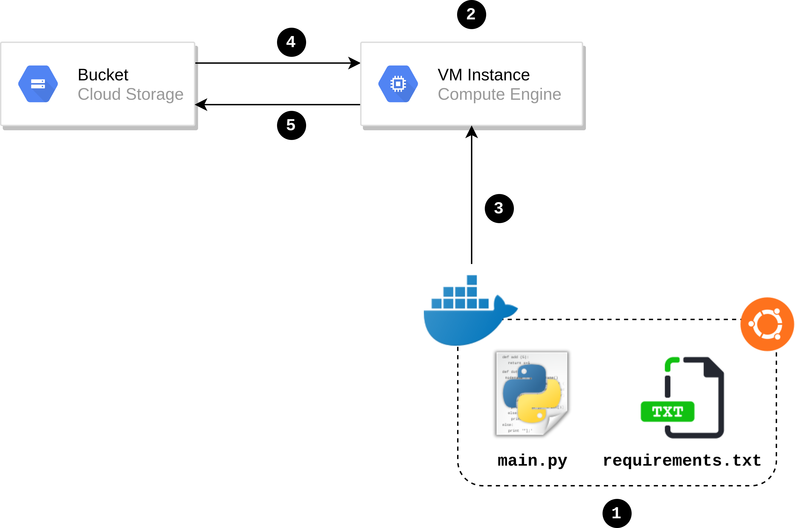

# Dockerize your Machine Learning model to train it on GCP!

⚠️ _**Please refer to my blog article here : https://lemaizi.com/blog/dockerize-your-machine-learning-model-to-train-it-on-gcp/, where all the functioning is explained in more details.**_

## The general architecture

The graph bellow describe summarily the general architecture used in this demo code.



- **Index 1** : A Docker image based on Ubuntu, to which we'll add the needed dependencies to make Python work with all the necessary requirements. The main script for doing the learning and communicating with our cloud storage bucket we'll be contained inside this image. After creating the image locally we'll push it to the Google Container Registry so it can be private  and callable from within.

- **Index 2** : A GCP computing instance, we call it VM (Virtual Machine) and this is our "computer" or "server". 

- **Index 3** : We will link our VM instance to the created Docker image (located in the Google Container Registry), so when the instance is launching it will load the container for the dockerized application.

- **Index 4** : Our training dataset is in the cloud storage bucket. When loading the Docker image our script (`main.py`) we'll load the training dataset using the GCP API used in Python. 

- **Index 5** : After doing our training using the resources of our VM instance we'll save our trained model in the cloud storage bucket.

You can adapt this architecture and the code in this repo to your needs and use case, what to get here is the general idea about how to dockerize your process and then put or pull data from your bucket.

## Project Tree

```bash
.
├── app
│   ├── main.py
│   └── requirements.txt
├── Dockerfile
└── iris.csv
```

## Shell execution

```bash
# We'll start by creating a new bucket, but first we need to authenticate
gcloud auth login

# Create a new bucket
# 'mb' means "make bucket"
# '-b on' to set the 'Uniform' option as seen before
# '-p' to specify the GCP project id we're working with
gsutil mb -b on -p <your-gcp-project-id> gs://<bucket-name>

# Upload the iris dataset
gsutil cp iris.csv gs://<bucket-name>

# Now we'll build our docker image locally
docker build -t <image-name> .

# We'll tag the image to push it to Google Container Registry
docker tag <image-name> gcr.io/<your-gcp-project-id>/<image-name>

# Pushing the image to GCR
gcloud docker -- push gcr.io/<your-gcp-project-id>/<image-name>

# Create a VM instance based on the image we've just created
# all the options seen in the GUI we'll be define here too
gcloud compute --project=<your-gcp-project-id> instances create-with-container <instance-name> \
	--container-image=gcr.io/<your-gcp-project-id>/<image-name> \
	--container-privileged \
	--scopes storage-rw \
	--zone us-central1-a

# Check the content of our bucket, to see if our model has been saved
gsutil ls gs://iris_ml_bucket

# Download the model locally
gsutil cp gs://<bucket-name>/trained_model.pkl trained_model.pkl
```

